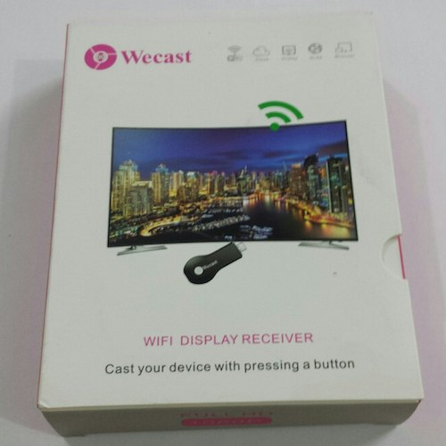

# Wecast
A short script to manage Wecast devices



Wecast is a WIFI Display Receiver that supports:

_AirPlay, DLNA, Miracast_

## Overscan
```bash
./wecast.sh overscan [0-100]
```

## Player options

```bash
./wecast.sh media-controll [play | pause | stop | rew | ffw | vol_up | pre | next | vol_down]
```
